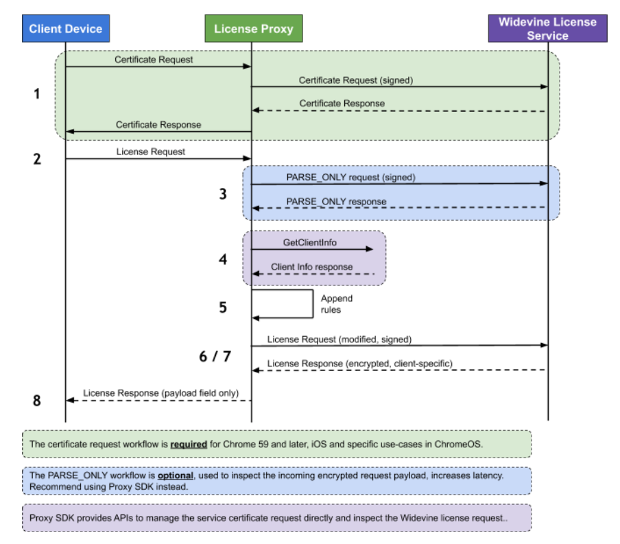

# Widevine Proxy 

Reference: Widevine DRM - Proxy Integration rev 2.20 - 1/10/2020


## Workflow




1. A client ​may​ generate a ​service certificate request​.
    - a. The proxy must sign the certificate request.
2. A client generates a license request and sends it to the license proxy.
    - a. The proxy authenticates the user and authorizes the request.
3. Providers not using the Proxy SDK:
    - a. This **​may​** include a requirement to view the license request details via a `PARSE_ONLY​` request.
4. Proxy SDK is used to query the license for information such as device make and model.
5. The proxy determines the desired business rules (if any).
6. The proxy calls GetLicense API using `HTTP POST`.
7. Widevine License service receives the license request
    - a. obtains content keys
    - b. generates a license
    - c. returns license to the proxy.
8. The proxy inspects GetLicense response status and forwards the license payload blob (as byte-stream) to client.

---
## Requirements
### Credentials
```json
{
    "licenser_server": "{URL}",
    "provider":"{WIDEVINE_PROVIDER}",
    "key": "{WIDEVINE_KEY}",
    "iv": "{WIDEVINE_IV}",
}
```
---
## Initalization

### Configuration Preparation

